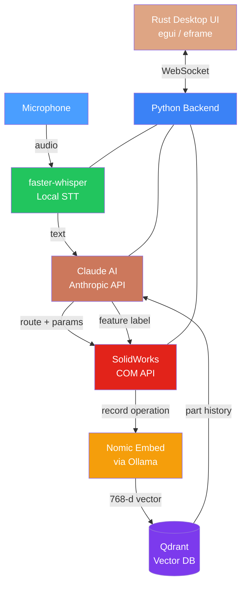

<div align="center">

# SolidWorks Voice AI

### Intelligent Voice-Controlled CAD Automation

[](LICENSE)
[](https://python.org)
[](ui/)
[](https://anthropic.com)
[](https://solidworks.com)
[](CONTRIBUTING.md)

**Talk to SolidWorks. Build anything.**

A voice-first SolidWorks automation platform powered by Claude AI, local Whisper speech recognition, and a vector memory system that gives every part persistent, context-aware history.

[Getting Started](#getting-started) · [Architecture](#architecture) · [Voice Commands](#voice-commands) · [Desktop UI](#desktop-ui-rust) · [Contributing](CONTRIBUTING.md)

---

</div>

## Highlights

| | Feature | Description |
|---|---|---|
| **Voice Control** | Local Whisper STT | Speak commands naturally — audio never leaves your machine |
| **AI Reasoning** | Claude (Anthropic) | Interprets intent, routes commands, generates feature labels |
| **Part Memory** | Qdrant + Nomic Embed | Every operation is embedded and stored — the AI remembers your part |
| **Smart Labels** | Auto Feature Naming | Claude names each feature in the tree (e.g. *"Base Plate Extrude"*) |
| **Desktop App** | Rust / egui | Native Windows UI with real-time status, history, and waveform |
| **Full API** | SolidWorks COM | Sketch, extrude, fillet, chamfer, mirror, pattern, export |

---

## Architecture



---

## Getting Started

### Prerequisites

| Component | Version | Install |
|-----------|---------|---------|
| SolidWorks | 2020 – 2025 | Set version in `config.ini` |
| Python | 3.10+ | [python.org](https://python.org) |
| Rust | 1.75+ | `curl --proto '=https' --tlsv1.2 -sSf https://sh.rustup.rs \| sh` |
| Ollama | latest | [ollama.com](https://ollama.com) → `ollama pull nomic-embed-text` |
| Qdrant | latest | `docker run -d -p 6333:6333 qdrant/qdrant` |
| Anthropic API Key | — | [console.anthropic.com](https://console.anthropic.com) |

### Quick Start

```bash
# 1. Clone the repository
git clone https://github.com/dawarazhar11/solidworks-voice-ai.git
cd solidworks-voice-ai

# 2. Install Python dependencies
pip install -r requirements.txt

# 3. Start infrastructure
docker run -d -p 6333:6333 qdrant/qdrant
ollama pull nomic-embed-text

# 4. Configure
#    Edit config.ini — add your Anthropic API key
```

#### Run the CLI

```bash
python solidworks_sketch.py
```

#### Run the Desktop UI

```bash
cd ui
cargo run --release
```

---

## Configuration

Edit `config.ini` to match your environment:

```ini
[ANTHROPIC]
API_KEY = sk-ant-...
BASE_URL =                          # leave blank for direct Anthropic API
MODEL = claude-sonnet-4-20250514

[SOLIDWORKS]
VERSION = 2025

[WHISPER]
MODEL_SIZE = base                   # tiny | base | small | medium | large-v3

[QDRANT]
URL = http://localhost:6333

[OLLAMA]
URL = http://localhost:11434
```

> **Proxy support:** To route through [sub2api](https://github.com/Wei-Shaw/sub2api), set `BASE_URL = http://your-server:8080/antigravity` and provide your sub2api key as `API_KEY`.

---

## Voice Commands

| Say this | What happens |
|----------|-------------|
| *"draw a rectangle"* | Creates a rectangle sketch |
| *"create a circle 5 cm radius"* | Circle sketch with specified dimensions |
| *"draw a line from 0,0 to 10,10"* | Line sketch between two points |
| *"extrude 10 millimetres"* | Boss-extrude the active sketch |
| *"add a fillet"* | Fillet selected edges |
| *"chamfer 2 mm"* | Chamfer selected edges |
| *"mirror about the right plane"* | Mirror features across a plane |
| *"create a pattern, 5 copies, 20 mm spacing"* | Linear pattern |
| *"add dimensions"* | Modify sketch dimensions by voice |
| *"export to STEP"* | Export the model |
| *"what have I done so far"* | Recall part history from memory |
| *"quit"* | Exit |

Commands are interpreted by Claude, so natural variations work — say it how you'd say it to a colleague.

---

## Part Memory System

Every part gets its own vector collection in Qdrant. Each feature operation is:

1. **Embedded** — `nomic-embed-text` (768-d) running locally in Ollama
2. **Stored** — with full metadata: feature type, AI label, voice command, parameters, timestamp
3. **Retrieved** — semantic search finds the most relevant history and injects it into the Claude prompt

This means you can say *"make the base plate thicker"* and Claude knows which extrude to modify, what its current depth is, and how to change it.

<details>
<summary><strong>Memory payload structure</strong></summary>

```json
{
  "feature_type": "extrude",
  "label": "Main Body Extrude",
  "user_intent": "extrude it by 10 millimetres",
  "parameters": { "depth": 0.01 },
  "timestamp": "2025-01-15T10:30:00Z",
  "description": "extrude: Main Body Extrude. Intent: extrude it by 10mm. Params: {'depth': 0.01}"
}
```

</details>

---

## Desktop UI (Rust)

The native Windows desktop app is built with [egui](https://github.com/emilk/egui) / [eframe](https://github.com/emilk/egui/tree/master/crates/eframe) and communicates with the Python backend over a local WebSocket.

### Features

- **Real-time voice waveform** — visual feedback while speaking
- **Command history panel** — scrollable log of every command and result
- **Feature tree viewer** — live SolidWorks feature tree with AI-generated labels
- **Connection dashboard** — status indicators for SolidWorks, Qdrant, Ollama, Claude
- **Dark theme** — professional dark UI optimized for engineering workflows

### Build

```bash
cd ui
cargo build --release
```

The compiled binary is at `ui/target/release/solidworks-voice-ai.exe`.

---

## Project Structure

```
├── solidworks_sketch.py        # Main CLI application (voice loop + Claude + SolidWorks)
├── part_memory.py              # Vector memory module (Qdrant + Ollama/Nomic)
├── config.ini                  # Configuration (API keys, models, versions)
├── requirements.txt            # Python dependencies
├── pySldWrap/                  # SolidWorks COM API wrapper
│   ├── __init__.py
│   └── sw_tools.py             # SW2012–SW2025 support
├── ui/                         # Rust desktop application
│   ├── Cargo.toml
│   ├── build.rs                # Windows manifest & icon
│   └── src/
│       ├── main.rs             # Entry point
│       ├── app.rs              # Application state & rendering
│       ├── backend.rs          # Python backend communication
│       ├── theme.rs            # Dark theme configuration
│       └── widgets/
│           ├── mod.rs
│           ├── status_bar.rs   # Connection status indicators
│           ├── voice_panel.rs  # Voice input + waveform
│           ├── history.rs      # Command history panel
│           └── feature_tree.rs # SolidWorks feature tree
├── .github/
│   ├── ISSUE_TEMPLATE/
│   │   ├── bug_report.md
│   │   └── feature_request.md
│   └── FUNDING.yml
├── CONTRIBUTING.md
└── LICENSE
```

---

## Dependencies

### Python

| Package | Purpose |
|---------|---------|
| `anthropic` | Claude API client |
| `faster-whisper` | Local Whisper speech-to-text (CTranslate2) |
| `qdrant-client` | Vector database client |
| `httpx` | HTTP client for Ollama embedding API |
| `pywin32` | Windows COM interface for SolidWorks |
| `SpeechRecognition` | Microphone audio capture |
| `PyAudio` | Audio I/O |

### Rust

| Crate | Purpose |
|-------|---------|
| `eframe` / `egui` | Native GUI framework |
| `tokio` | Async runtime |
| `tungstenite` | WebSocket client |
| `serde` / `serde_json` | JSON serialization |
| `tracing` | Structured logging |

---

## Star History

<a href="https://star-history.com/#dawarazhar11/solidworks-voice-ai&Date">
 <picture>
   <source media="(prefers-color-scheme: dark)" srcset="https://api.star-history.com/svg?repos=dawarazhar11/solidworks-voice-ai&type=Date&theme=dark" />
   <source media="(prefers-color-scheme: light)" srcset="https://api.star-history.com/svg?repos=dawarazhar11/solidworks-voice-ai&type=Date" />
   
 </picture>
</a>

---

## Contributing

Contributions are welcome! Please read the [Contributing Guide](CONTRIBUTING.md) before submitting a PR.

## License

MIT License — see [LICENSE](LICENSE) for details.

---

<div align="center">
  <sub>Built with Claude AI · Whisper · Qdrant · SolidWorks COM API · Rust egui</sub>
</div>
